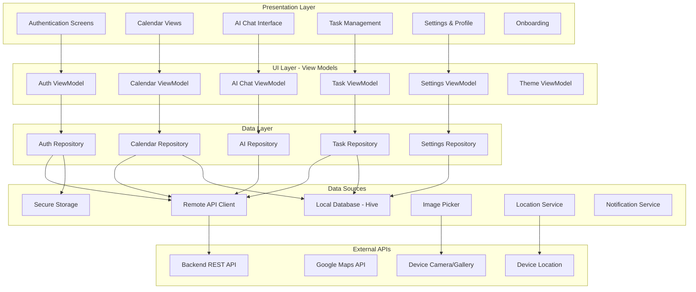

# Design Document

## Overview

This design document focuses on the Flutter frontend mobile application for Orbit, an intelligent calendar and planning solution. The Flutter app provides the user interface and client-side logic for AI-powered calendar management, featuring neumorphic UI design, natural language processing integration, and offline-first architecture. The app communicates with backend services via REST APIs and provides a seamless, intelligent user experience for calendar and task management.

## Architecture

### Flutter App Architecture Overview



### Flutter App Architecture Details

The Flutter app follows the official Flutter MVVM (Model-View-ViewModel) architecture as recommended in the Flutter documentation:

#### **UI Layer**
- **Views**: Widget classes that describe how to present data to users
- **View Models**: Handle business logic and convert app data into UI state
- **Theme**: Consistent design system with dark/light mode support

#### **Data Layer**
- **Repositories**: Source of truth for model data, handle business logic
- **Services**: Wrap API endpoints and expose asynchronous response objects
- **Domain Models**: Represent data formatted for view model consumption

#### **Optional Domain Layer**
- **Use Cases**: Encapsulate complex business logic that would otherwise live in view models
- **Interactors**: Handle interactions between UI and Data layers

#### **MVVM Architecture Pattern**
Following the official Flutter MVVM recommendations:
- Views and view models have a one-to-one relationship
- View models manage UI state, views display that state
- Repositories are the source of truth for data
- Services handle external data sources

**MVVM Structure Example:**
```dart
// View Model
class CalendarViewModel extends ChangeNotifier {
  final CalendarRepository _repository;
  
  List<Event> _events = [];
  bool _isLoading = false;
  String? _error;
  
  List<Event> get events => _events;
  bool get isLoading => _isLoading;
  String? get error => _error;
  
  CalendarViewModel(this._repository);
  
  Future<void> loadEvents(DateTime start, DateTime end) async {
    _isLoading = true;
    _error = null;
    notifyListeners();
    
    try {
      _events = await _repository.getEvents(start, end);
    } catch (e) {
      _error = e.toString();
    } finally {
      _isLoading = false;
      notifyListeners();
    }
  }
  
  // Commands (callbacks for view interactions)
  Future<void> createEventCommand(Event event) async {
    await _repository.createEvent(event);
    // Refresh events after creation
    await loadEvents(/* current date range */);
  }
}

// View
class CalendarView extends StatelessWidget {
  @override
  Widget build(BuildContext context) {
    return ChangeNotifierProvider(
      create: (_) => CalendarViewModel(context.read<CalendarRepository>()),
      child: Consumer<CalendarViewModel>(
        builder: (context, viewModel, child) {
          if (viewModel.isLoading) {
            return CircularProgressIndicator();
          }
          
          if (viewModel.error != null) {
            return ErrorWidget(viewModel.error!);
          }
          
          return CalendarWidget(
            events: viewModel.events,
            onEventCreate: viewModel.createEventCommand,
          );
        },
      ),
    );
  }
}
```

#### **Data Layer**
- **Repositories**: Abstract data access interfaces
- **Data Sources**: Concrete implementations (remote/local)
- **Models**: Data transfer objects and domain entities
- **Mappers**: Convert between different data representations

#### **Local Storage Strategy**
- **Hive**: Primary local database for offline functionality
- **Secure Storage**: JWT tokens and sensitive data
- **Shared Preferences**: App settings and user preferences
- **File Storage**: Cached images and documents

## Components and Interfaces

### Frontend Components

#### 1. Authentication Module
```dart
// Core authentication interface
abstract class AuthRepository {
  Future<AuthResult> login(String email, String password);
  Future<AuthResult> register(UserRegistration registration);
  Future<void> logout();
  Future<bool> isAuthenticated();
  Stream<AuthState> get authStateStream;
}

// JWT token management
class TokenManager {
  Future<void> storeTokens(String accessToken, String refreshToken);
  Future<String?> getAccessToken();
  Future<bool> refreshToken();
}
```

#### 2. Calendar Views
```dart
// Calendar view interface
abstract class CalendarView extends StatelessWidget {
  final DateTime focusedDate;
  final List<Event> events;
  final Function(Event) onEventTap;
  final Function(DateTime) onDateTap;
}

// Multi-view calendar controller
class CalendarController extends ChangeNotifier {
  CalendarViewType _currentView = CalendarViewType.month;
  DateTime _focusedDate = DateTime.now();
  List<Event> _events = [];
  
  void switchView(CalendarViewType viewType);
  void navigateToDate(DateTime date);
  Future<void> loadEvents(DateRange range);
}
```

#### 3. AI Chat Interface
```dart
// Conversational AI interface
class ChatService {
  Stream<ChatMessage> sendMessage(String message);
  Future<List<SchedulingSuggestion>> getSchedulingSuggestions(String query);
  Future<ConflictResolution> resolveScheduleConflict(List<Event> conflicts);
}

// Natural language input processor
class NLPInputProcessor {
  Future<EventSuggestion> parseNaturalLanguage(String input);
  Future<TaskSuggestion> parseTaskInput(String input);
}
```

#### 4. OCR Integration
```dart
// OCR service interface
class OCRService {
  Future<OCRResult> processImage(File imageFile);
  Future<List<EventSuggestion>> extractEventsFromText(String text);
}

// Image picker and processor
class ImageEventExtractor {
  Future<File?> pickImage();
  Future<List<EventSuggestion>> processImageForEvents(File image);
}
```

### API Client Interface

The Flutter app communicates with backend services through a centralized API client:

```dart
// Main API client for backend communication
class OrbitApiClient {
  final Dio _dio;
  final String baseUrl;
  
  OrbitApiClient({required this.baseUrl}) : _dio = Dio() {
    _setupInterceptors();
  }
  
  void _setupInterceptors() {
    _dio.interceptors.addAll([
      AuthInterceptor(),
      LoggingInterceptor(),
      ErrorInterceptor(),
    ]);
  }
  
  // Authentication endpoints
  Future<AuthResponse> login(LoginRequest request);
  Future<AuthResponse> register(RegisterRequest request);
  Future<void> logout();
  Future<AuthResponse> refreshToken();
  
  // Calendar endpoints
  Future<List<Event>> getEvents(DateTime start, DateTime end);
  Future<Event> createEvent(CreateEventRequest request);
  Future<Event> updateEvent(String id, UpdateEventRequest request);
  Future<void> deleteEvent(String id);
  
  // AI endpoints
  Future<NLPResponse> processNaturalLanguage(String text);
  Future<OCRResponse> processImage(File image);
  Future<List<Suggestion>> getSchedulingSuggestions(SuggestionRequest request);
  
  // Task endpoints
  Future<List<Task>> getTasks(TaskFilter filter);
  Future<Task> createTask(CreateTaskRequest request);
  Future<Task> updateTask(String id, UpdateTaskRequest request);
  Future<void> completeTask(String id);
}
```

## Data Models

### Flutter Data Models

#### User Model
```dart
@HiveType(typeId: 0)
class User extends HiveObject {
  @HiveField(0)
  final String id;
  
  @HiveField(1)
  final String email;
  
  @HiveField(2)
  final String firstName;
  
  @HiveField(3)
  final String lastName;
  
  @HiveField(4)
  final String timezone;
  
  @HiveField(5)
  final Map<String, dynamic> preferences;
  
  @HiveField(6)
  final DateTime createdAt;
  
  @HiveField(7)
  final DateTime updatedAt;
  
  User({
    required this.id,
    required this.email,
    required this.firstName,
    required this.lastName,
    required this.timezone,
    required this.preferences,
    required this.createdAt,
    required this.updatedAt,
  });
  
  factory User.fromJson(Map<String, dynamic> json) => User(
    id: json['id'],
    email: json['email'],
    firstName: json['first_name'],
    lastName: json['last_name'],
    timezone: json['timezone'],
    preferences: json['preferences'] ?? {},
    createdAt: DateTime.parse(json['created_at']),
    updatedAt: DateTime.parse(json['updated_at']),
  );
  
  Map<String, dynamic> toJson() => {
    'id': id,
    'email': email,
    'first_name': firstName,
    'last_name': lastName,
    'timezone': timezone,
    'preferences': preferences,
    'created_at': createdAt.toIso8601String(),
    'updated_at': updatedAt.toIso8601String(),
  };
}
```

#### Event Model
```dart
@HiveType(typeId: 1)
class Event extends HiveObject {
  @HiveField(0)
  final String id;
  
  @HiveField(1)
  final String userId;
  
  @HiveField(2)
  final String title;
  
  @HiveField(3)
  final String? description;
  
  @HiveField(4)
  final DateTime startTime;
  
  @HiveField(5)
  final DateTime endTime;
  
  @HiveField(6)
  final String? location;
  
  @HiveField(7)
  final String category;
  
  @HiveField(8)
  final int priority;
  
  @HiveField(9)
  final bool isAllDay;
  
  @HiveField(10)
  final String? recurrenceRule;
  
  @HiveField(11)
  final String? externalId;
  
  @HiveField(12)
  final String? externalSource;
  
  @HiveField(13)
  final DateTime createdAt;
  
  @HiveField(14)
  final DateTime updatedAt;
  
  @HiveField(15)
  final bool isSynced;
  
  Event({
    required this.id,
    required this.userId,
    required this.title,
    this.description,
    required this.startTime,
    required this.endTime,
    this.location,
    required this.category,
    required this.priority,
    required this.isAllDay,
    this.recurrenceRule,
    this.externalId,
    this.externalSource,
    required this.createdAt,
    required this.updatedAt,
    this.isSynced = false,
  });
  
  factory Event.fromJson(Map<String, dynamic> json) => Event(
    id: json['id'],
    userId: json['user_id'],
    title: json['title'],
    description: json['description'],
    startTime: DateTime.parse(json['start_time']),
    endTime: DateTime.parse(json['end_time']),
    location: json['location'],
    category: json['category'],
    priority: json['priority'],
    isAllDay: json['is_all_day'],
    recurrenceRule: json['recurrence_rule'],
    externalId: json['external_id'],
    externalSource: json['external_source'],
    createdAt: DateTime.parse(json['created_at']),
    updatedAt: DateTime.parse(json['updated_at']),
    isSynced: true,
  );
  
  Map<String, dynamic> toJson() => {
    'id': id,
    'user_id': userId,
    'title': title,
    'description': description,
    'start_time': startTime.toIso8601String(),
    'end_time': endTime.toIso8601String(),
    'location': location,
    'category': category,
    'priority': priority,
    'is_all_day': isAllDay,
    'recurrence_rule': recurrenceRule,
    'external_id': externalId,
    'external_source': externalSource,
    'created_at': createdAt.toIso8601String(),
    'updated_at': updatedAt.toIso8601String(),
  };
}
```

#### Task Model
```dart
@HiveType(typeId: 2)
class Task extends HiveObject {
  @HiveField(0)
  final String id;
  
  @HiveField(1)
  final String userId;
  
  @HiveField(2)
  final String title;
  
  @HiveField(3)
  final String? description;
  
  @HiveField(4)
  final int priority;
  
  @HiveField(5)
  final DateTime? dueDate;
  
  @HiveField(6)
  final String category;
  
  @HiveField(7)
  final TaskStatus status;
  
  @HiveField(8)
  final int? estimatedDuration; // in minutes
  
  @HiveField(9)
  final int? actualDuration;
  
  @HiveField(10)
  final String? parentTaskId;
  
  @HiveField(11)
  final DateTime createdAt;
  
  @HiveField(12)
  final DateTime updatedAt;
  
  @HiveField(13)
  final DateTime? completedAt;
  
  @HiveField(14)
  final bool isSynced;
  
  Task({
    required this.id,
    required this.userId,
    required this.title,
    this.description,
    required this.priority,
    this.dueDate,
    required this.category,
    required this.status,
    this.estimatedDuration,
    this.actualDuration,
    this.parentTaskId,
    required this.createdAt,
    required this.updatedAt,
    this.completedAt,
    this.isSynced = false,
  });
}

@HiveType(typeId: 3)
enum TaskStatus {
  @HiveField(0)
  pending,
  
  @HiveField(1)
  inProgress,
  
  @HiveField(2)
  completed,
  
  @HiveField(3)
  cancelled,
}
```

#### AI Response Models
```dart
class NLPResponse {
  final String intent;
  final Map<String, String> entities;
  final double confidence;
  final EventSuggestion? eventSuggestion;
  final TaskSuggestion? taskSuggestion;
  
  NLPResponse({
    required this.intent,
    required this.entities,
    required this.confidence,
    this.eventSuggestion,
    this.taskSuggestion,
  });
  
  factory NLPResponse.fromJson(Map<String, dynamic> json) => NLPResponse(
    intent: json['intent'],
    entities: Map<String, String>.from(json['entities']),
    confidence: json['confidence'].toDouble(),
    eventSuggestion: json['event_suggestion'] != null 
        ? EventSuggestion.fromJson(json['event_suggestion']) 
        : null,
    taskSuggestion: json['task_suggestion'] != null 
        ? TaskSuggestion.fromJson(json['task_suggestion']) 
        : null,
  );
}

class EventSuggestion {
  final String title;
  final DateTime? suggestedStartTime;
  final DateTime? suggestedEndTime;
  final String? location;
  final String? category;
  final double confidence;
  
  EventSuggestion({
    required this.title,
    this.suggestedStartTime,
    this.suggestedEndTime,
    this.location,
    this.category,
    required this.confidence,
  });
  
  factory EventSuggestion.fromJson(Map<String, dynamic> json) => EventSuggestion(
    title: json['title'],
    suggestedStartTime: json['suggested_start_time'] != null 
        ? DateTime.parse(json['suggested_start_time']) 
        : null,
    suggestedEndTime: json['suggested_end_time'] != null 
        ? DateTime.parse(json['suggested_end_time']) 
        : null,
    location: json['location'],
    category: json['category'],
    confidence: json['confidence'].toDouble(),
  );
}
```

## Error Handling

### Frontend Error Handling Strategy

#### 1. Network Error Handling
```dart
class NetworkErrorHandler {
  static Future<T> handleNetworkCall<T>(Future<T> Function() networkCall) async {
    try {
      return await networkCall();
    } on SocketException {
      throw NetworkException('No internet connection');
    } on TimeoutException {
      throw NetworkException('Request timeout');
    } on HttpException catch (e) {
      throw NetworkException('HTTP error: ${e.message}');
    }
  }
}

// Error state management
class ErrorState {
  final String message;
  final ErrorType type;
  final bool isRetryable;
  
  const ErrorState({
    required this.message,
    required this.type,
    this.isRetryable = false,
  });
}
```

#### 2. AI Processing Error Handling
```dart
class AIErrorHandler {
  static Future<AIResult<T>> handleAICall<T>(Future<T> Function() aiCall) async {
    try {
      final result = await aiCall();
      return AIResult.success(result);
    } on AIProcessingException catch (e) {
      return AIResult.failure(e.message, fallbackAvailable: e.hasFallback);
    } on RateLimitException {
      return AIResult.failure('AI service temporarily unavailable', retryAfter: Duration(minutes: 1));
    }
  }
}
```

### Offline Synchronization Strategy

#### 1. Sync Manager
```dart
class SyncManager {
  final OrbitApiClient _apiClient;
  final LocalDatabase _localDb;
  final ConnectivityService _connectivity;
  
  SyncManager(this._apiClient, this._localDb, this._connectivity);
  
  Future<void> syncAll() async {
    if (!await _connectivity.isConnected) return;
    
    try {
      await Future.wait([
        _syncEvents(),
        _syncTasks(),
        _syncUserPreferences(),
      ]);
    } catch (e) {
      // Handle sync errors gracefully
      _handleSyncError(e);
    }
  }
  
  Future<void> _syncEvents() async {
    // Get unsynchronized local events
    final localEvents = await _localDb.getUnsyncedEvents();
    
    // Upload local changes
    for (final event in localEvents) {
      try {
        if (event.id.startsWith('local_')) {
          // Create new event on server
          final serverEvent = await _apiClient.createEvent(
            CreateEventRequest.fromEvent(event)
          );
          await _localDb.updateEventWithServerId(event.id, serverEvent.id);
        } else {
          // Update existing event
          await _apiClient.updateEvent(event.id, UpdateEventRequest.fromEvent(event));
        }
        await _localDb.markEventAsSynced(event.id);
      } catch (e) {
        // Handle individual sync failures
        _handleEventSyncError(event, e);
      }
    }
    
    // Download server changes
    final lastSync = await _localDb.getLastSyncTime();
    final serverEvents = await _apiClient.getEventsSince(lastSync);
    
    for (final serverEvent in serverEvents) {
      await _localDb.upsertEvent(serverEvent);
    }
    
    await _localDb.updateLastSyncTime(DateTime.now());
  }
}
```

#### 2. Conflict Resolution
```dart
class ConflictResolver {
  static Future<Event> resolveEventConflict(
    Event localEvent, 
    Event serverEvent
  ) async {
    // Simple last-write-wins strategy
    if (localEvent.updatedAt.isAfter(serverEvent.updatedAt)) {
      return localEvent;
    } else {
      return serverEvent;
    }
  }
  
  static Future<ConflictResolution> showConflictDialog(
    BuildContext context,
    Event localEvent,
    Event serverEvent,
  ) async {
    return showDialog<ConflictResolution>(
      context: context,
      builder: (context) => ConflictResolutionDialog(
        localEvent: localEvent,
        serverEvent: serverEvent,
      ),
    ) ?? ConflictResolution.useServer;
  }
}

enum ConflictResolution {
  useLocal,
  useServer,
  merge,
}
```

## Testing Strategy

### Frontend Testing Approach

#### 1. Unit Testing
```dart
// Widget testing example
testWidgets('Calendar view displays events correctly', (WidgetTester tester) async {
  final mockEvents = [
    Event(id: '1', title: 'Meeting', startTime: DateTime.now()),
    Event(id: '2', title: 'Lunch', startTime: DateTime.now().add(Duration(hours: 2))),
  ];
  
  await tester.pumpWidget(
    MaterialApp(
      home: CalendarView(events: mockEvents),
    ),
  );
  
  expect(find.text('Meeting'), findsOneWidget);
  expect(find.text('Lunch'), findsOneWidget);
});

// State management testing
group('CalendarController Tests', () {
  late CalendarController controller;
  
  setUp(() {
    controller = CalendarController();
  });
  
  test('should switch calendar view correctly', () {
    controller.switchView(CalendarViewType.week);
    expect(controller.currentView, CalendarViewType.week);
  });
});
```

#### 2. Integration Testing
```dart
// Integration test for AI features
testWidgets('Natural language input creates event', (WidgetTester tester) async {
  await tester.pumpWidget(MyApp());
  
  // Navigate to event creation
  await tester.tap(find.byIcon(Icons.add));
  await tester.pumpAndSettle();
  
  // Enter natural language input
  await tester.enterText(find.byType(TextField), 'Meeting with John tomorrow at 2pm');
  await tester.tap(find.text('Process with AI'));
  await tester.pumpAndSettle();
  
  // Verify AI processing result
  expect(find.text('Meeting with John'), findsOneWidget);
  expect(find.text('Tomorrow 2:00 PM'), findsOneWidget);
});
```

### Flutter Testing Strategy

#### 1. Repository Testing
```dart
// Repository unit test example
group('CalendarRepository Tests', () {
  late CalendarRepository repository;
  late MockApiClient mockApiClient;
  late MockLocalDatabase mockLocalDb;
  
  setUp(() {
    mockApiClient = MockApiClient();
    mockLocalDb = MockLocalDatabase();
    repository = CalendarRepository(mockApiClient, mockLocalDb);
  });
  
  test('should create event and sync to server', () async {
    // Arrange
    final event = Event(
      id: 'local_123',
      userId: 'user_1',
      title: 'Test Event',
      startTime: DateTime.now(),
      endTime: DateTime.now().add(Duration(hours: 1)),
      category: 'meeting',
      priority: 1,
      isAllDay: false,
      createdAt: DateTime.now(),
      updatedAt: DateTime.now(),
    );
    
    when(mockLocalDb.saveEvent(event)).thenAnswer((_) async => event);
    when(mockApiClient.createEvent(any)).thenAnswer((_) async => event.copyWith(id: 'server_123'));
    
    // Act
    final result = await repository.createEvent(event);
    
    // Assert
    expect(result.id, 'server_123');
    verify(mockLocalDb.saveEvent(event)).called(1);
    verify(mockApiClient.createEvent(any)).called(1);
  });
  
  test('should handle offline event creation', () async {
    // Arrange
    final event = Event(/* ... */);
    when(mockApiClient.createEvent(any)).thenThrow(NetworkException('No internet'));
    when(mockLocalDb.saveEvent(event)).thenAnswer((_) async => event);
    
    // Act
    final result = await repository.createEvent(event);
    
    // Assert
    expect(result.isSynced, false);
    verify(mockLocalDb.saveEvent(event)).called(1);
    verifyNever(mockApiClient.createEvent(any));
  });
});
```

#### 2. ViewModel Testing
```dart
// ViewModel unit test example
group('CalendarViewModel Tests', () {
  late CalendarViewModel viewModel;
  late MockCalendarRepository mockRepository;
  
  setUp(() {
    mockRepository = MockCalendarRepository();
    viewModel = CalendarViewModel(mockRepository);
  });
  
  tearDown(() {
    viewModel.dispose();
  });
  
  test('should load events successfully', () async {
    // Arrange
    final testEvents = [testEvent1, testEvent2];
    when(mockRepository.getEvents(any, any))
        .thenAnswer((_) async => testEvents);
    
    // Act
    await viewModel.loadEvents(
      DateTime(2025, 9, 1),
      DateTime(2025, 9, 30),
    );
    
    // Assert
    expect(viewModel.events, testEvents);
    expect(viewModel.isLoading, false);
    expect(viewModel.error, null);
    verify(mockRepository.getEvents(any, any)).called(1);
  });
  
  test('should handle loading state correctly', () async {
    // Arrange
    when(mockRepository.getEvents(any, any))
        .thenAnswer((_) async {
          await Future.delayed(Duration(milliseconds: 100));
          return [testEvent1];
        });
    
    // Act
    final loadingFuture = viewModel.loadEvents(
      DateTime(2025, 9, 1),
      DateTime(2025, 9, 30),
    );
    
    // Assert - Check loading state
    expect(viewModel.isLoading, true);
    
    await loadingFuture;
    
    // Assert - Check final state
    expect(viewModel.isLoading, false);
    expect(viewModel.events.length, 1);
  });
  
  test('should handle error state correctly', () async {
    // Arrange
    when(mockRepository.getEvents(any, any))
        .thenThrow(NetworkException('Failed to load events'));
    
    // Act
    await viewModel.loadEvents(
      DateTime(2025, 9, 1),
      DateTime(2025, 9, 30),
    );
    
    // Assert
    expect(viewModel.error, 'Failed to load events');
    expect(viewModel.isLoading, false);
    expect(viewModel.events, isEmpty);
  });
  
  test('should create event and refresh list', () async {
    // Arrange
    final newEvent = Event(/* ... */);
    when(mockRepository.createEvent(newEvent))
        .thenAnswer((_) async => newEvent);
    when(mockRepository.getEvents(any, any))
        .thenAnswer((_) async => [newEvent]);
    
    // Act
    await viewModel.createEventCommand(newEvent);
    
    // Assert
    verify(mockRepository.createEvent(newEvent)).called(1);
    expect(viewModel.events, contains(newEvent));
  });
});
```

#### 3. Widget Testing
```dart
// Widget test example
group('CalendarView Widget Tests', () {
  testWidgets('displays events correctly', (WidgetTester tester) async {
    // Arrange
    final events = [
      Event(
        id: '1',
        title: 'Meeting',
        startTime: DateTime(2025, 9, 23, 14, 0),
        endTime: DateTime(2025, 9, 23, 15, 0),
        /* ... */
      ),
      Event(
        id: '2',
        title: 'Lunch',
        startTime: DateTime(2025, 9, 23, 12, 0),
        endTime: DateTime(2025, 9, 23, 13, 0),
        /* ... */
      ),
    ];
    
    // Act
    await tester.pumpWidget(
      MaterialApp(
        home: CalendarView(
          events: events,
          focusedDate: DateTime(2025, 9, 23),
        ),
      ),
    );
    
    // Assert
    expect(find.text('Meeting'), findsOneWidget);
    expect(find.text('Lunch'), findsOneWidget);
    expect(find.text('14:00'), findsOneWidget);
    expect(find.text('12:00'), findsOneWidget);
  });
  
  testWidgets('navigates to event details on tap', (WidgetTester tester) async {
    // Arrange
    bool eventTapped = false;
    final event = Event(/* ... */);
    
    // Act
    await tester.pumpWidget(
      MaterialApp(
        home: CalendarView(
          events: [event],
          onEventTap: (tappedEvent) {
            eventTapped = true;
            expect(tappedEvent.id, event.id);
          },
        ),
      ),
    );
    
    await tester.tap(find.text(event.title));
    await tester.pumpAndSettle();
    
    // Assert
    expect(eventTapped, true);
  });
});
```

#### 4. Integration Testing
```dart
// Integration test example
void main() {
  group('Calendar Integration Tests', () {
    testWidgets('complete event creation flow', (WidgetTester tester) async {
      // Arrange
      await tester.pumpWidget(MyApp());
      
      // Act - Navigate to create event screen
      await tester.tap(find.byIcon(Icons.add));
      await tester.pumpAndSettle();
      
      // Enter event details
      await tester.enterText(find.byKey(Key('title_field')), 'Integration Test Event');
      await tester.tap(find.byKey(Key('date_picker')));
      await tester.pumpAndSettle();
      
      // Select date
      await tester.tap(find.text('23'));
      await tester.tap(find.text('OK'));
      await tester.pumpAndSettle();
      
      // Save event
      await tester.tap(find.byKey(Key('save_button')));
      await tester.pumpAndSettle();
      
      // Assert - Event appears in calendar
      expect(find.text('Integration Test Event'), findsOneWidget);
    });
    
    testWidgets('AI natural language processing flow', (WidgetTester tester) async {
      // Arrange
      await tester.pumpWidget(MyApp());
      
      // Act - Use AI input
      await tester.tap(find.byIcon(Icons.mic));
      await tester.pumpAndSettle();
      
      await tester.enterText(
        find.byKey(Key('ai_input_field')), 
        'Meeting with John tomorrow at 2pm'
      );
      await tester.tap(find.byKey(Key('process_ai_button')));
      await tester.pumpAndSettle();
      
      // Assert - AI suggestions appear
      expect(find.text('Meeting with John'), findsOneWidget);
      expect(find.textContaining('2:00 PM'), findsOneWidget);
      
      // Confirm AI suggestion
      await tester.tap(find.byKey(Key('confirm_ai_suggestion')));
      await tester.pumpAndSettle();
      
      // Assert - Event is created
      expect(find.text('Meeting with John'), findsOneWidget);
    });
  });
}
```

This comprehensive design document provides the foundation for implementing the Orbit intelligent calendar application, covering all major architectural components, interfaces, data models, error handling strategies, and testing approaches based on the requirements and technical specifications from your proposal.