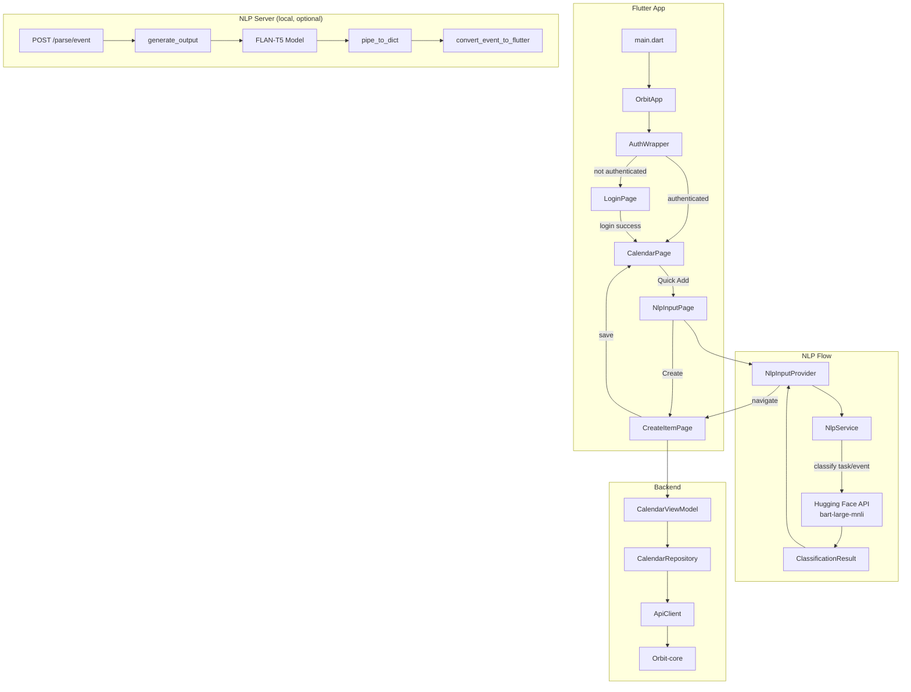

# Orbit Function Architecture Flowchart

## Visual Flowchart (Mermaid)



---

## 1. App Entry & Auth Flow

```
main.dart
    │
    ▼
OrbitApp (MultiProvider)
    │
    ├── AuthViewModel
    ├── CalendarViewModel
    │
    ▼
AuthWrapper
    │
    ├── [Initial check] AuthViewModel.checkAuthStatus()
    │
    ├── isAuthenticated? ──Yes──► HomeScreen (CalendarPage)
    │
    └── No ─────────────────────► LoginPage
                                      │
                                      └── AuthViewModel.login() ──► HomeScreen
```

---

## 2. NLP Quick Add Flow (Flutter)

```
CalendarPage
    │
    │  User taps "Quick Add" / FAB
    ▼
NlpInputPage
    │
    │  User enters: "Meeting with John tomorrow at 3pm for 1 hour"
    │  User taps "Create"
    ▼
NlpInputProvider.parseInput(text)
    │
    ▼
NlpService.classifyText(text)
    │
    │  HTTP POST → Hugging Face API (router.huggingface.co)
    │  Model: facebook/bart-large-mnli
    │  Candidate labels: ["task", "event"]
    │
    ▼
ClassificationResult (type: "event", confidence: 0.85)
    │
    ▼
NlpInputProvider stores NlpParseResult (type, title=text, confidence)
    │
    ▼
Navigator.pushReplacement ──► CreateItemPage(initialIsEvent: true)
    │
    │  User fills/edits form (name, dates, details)
    │  User taps "Create"
    ▼
CalendarViewModel.createEvent(event)
    │
    ▼
CalendarRepository.createEvent()
    │
    ▼
ApiClient ──► Orbit-core backend (gRPC/REST)
```

---

## 3. NLP Server (Local T5 Parser) — Not Yet Wired to Flutter

```
HTTP POST /parse/event
    │
    │  Body: {"text": "Meeting with John tomorrow at 3pm for 1 hour"}
    ▼
generate_output(model, tokenizer, text, "parse event")
    │
    │  1. input_text = "parse event: Meeting with John tomorrow..."
    │  2. tokenizer(input_text)
    │  3. model.generate(...)
    │  4. tokenizer.decode(outputs)
    │
    ▼
Raw output: "action: Meeting | date: 15/01/2026 | time: 03:00 PM | attendees: John | ..."
    │
    ▼
pipe_to_dict(generated_text)  →  {"action": "Meeting", "date": "15/01/2026", ...}
    │
    ▼
convert_event_to_flutter(parsed_data)
    │
    │  Parse date/time, duration, attendees, recurrence
    │  Build EventOutput (title, start_time, end_time, location, description)
    │
    ▼
EventOutput (Flutter-compatible JSON)
```

---

## 4. Training Pipeline (NLP Server)

```
event_text_mapping.jsonl
event_text_mapping_expanded.jsonl (2502 examples)
    │
    │  Format: {"event_text": "...", "output": {"action": "...", "date": "...", ...}}
    ▼
data_preprocessing.py
    │
    │  output_to_pipe_format()  — JSON → "action: X | date: Y | time: Z | ..."
    │  (T5 cannot tokenize { } — uses pipe format instead)
    ▼
event_training_data.jsonl
    │
    │  Format: {"input": "parse event: ...", "output": "action: X | date: Y | ..."}
    ▼
train_event_parser.py
    │
    │  1. Load FLAN-T5-small
    │  2. Tokenize (no padding in preprocessing; DataCollator handles it)
    │  3. Seq2SeqTrainer (fp16=False, bf16 if supported)
    │  4. Train 15 epochs
    ▼
models/event-parser/
    │
    │  config.json, model.safetensors, tokenizer*.json, spiece.model
    ▼
server.py loads model at startup
test_model.py for validation
```

---

## 5. Data Models

```
┌─────────────────────────────────────────────────────────────────────────────┐
│ NlpParseResult (Flutter)                                                     │
├─────────────────────────────────────────────────────────────────────────────┤
│ type, title, description, startTime, endTime, dueDate, location, priority,   │
│ confidence, originalText                                                     │
└─────────────────────────────────────────────────────────────────────────────┘

┌─────────────────────────────────────────────────────────────────────────────┐
│ EventModel (Flutter)                                                         │
├─────────────────────────────────────────────────────────────────────────────┤
│ id, userId, title, description, startTime, endTime, location, createdAt,     │
│ updatedAt                                                                   │
└─────────────────────────────────────────────────────────────────────────────┘

┌─────────────────────────────────────────────────────────────────────────────┐
│ TaskModel (Flutter)                                                          │
├─────────────────────────────────────────────────────────────────────────────┤
│ id, userId, title, description, dueDate, completed, priority, createdAt,     │
│ updatedAt                                                                   │
└─────────────────────────────────────────────────────────────────────────────┘

┌─────────────────────────────────────────────────────────────────────────────┐
│ Server Output Format (pipe) → Dict                                           │
├─────────────────────────────────────────────────────────────────────────────┤
│ action, date, time, attendees, location, duration, recurrence, notes         │
└─────────────────────────────────────────────────────────────────────────────┘
```

---

## 6. Component Dependency Overview

```
                    ┌─────────────────┐
                    │   Flutter App   │
                    └────────┬────────┘
                             │
         ┌───────────────────┼───────────────────┐
         │                   │                   │
         ▼                   ▼                   ▼
┌─────────────────┐ ┌───────────────┐ ┌─────────────────────┐
│ Hugging Face    │ │ Orbit-core    │ │ (Future: NLP Server) │
│ API             │ │ Backend       │ │ localhost:5000       │
│ Classification  │ │ Calendar CRUD │ │ /parse/event         │
└─────────────────┘ └───────────────┘ │ /parse/task          │
                                      └─────────────────────┘
```

---

## 7. File Mapping

| Component           | Flutter Path                              | NLP Server Path                          |
|--------------------|-------------------------------------------|------------------------------------------|
| NLP Classification | `lib/data/services/nlp_service.dart`      | — (Hugging Face API)                     |
| NLP State          | `lib/ui/nlp_input/nlp_input_provider.dart`| —                                         |
| NLP Input UI       | `lib/ui/nlp_input/view/nlp_input_page.dart`| —                                        |
| Create Item UI     | `lib/ui/tasks/view/create_item_page.dart` | —                                         |
| Calendar ViewModel | `lib/ui/calendar/view_model/calendar_view_model.dart` | —                        |
| Calendar Repo      | `lib/data/repositories/calendar_repository.dart` | —                             |
| Parse API          | —                                         | `nlp-server/server.py`                    |
| Data Preprocessing | —                                         | `nlp-server/utils/data_preprocessing.py`  |
| Training           | —                                         | `nlp-server/train_event_parser.py`        |
